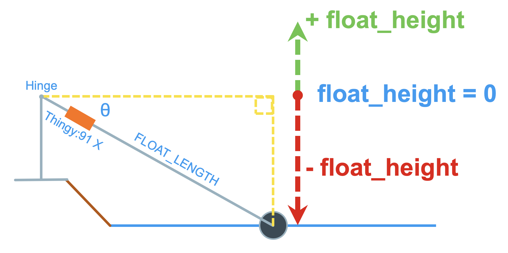

<!-- SPDX-FileCopyrightText: 2022-2023 Golioth, Inc. -->
<!-- SPDX-FileCopyrightText: 2025 Common Ground Electronics <https://cgnd.dev> -->
<!-- SPDX-License-Identifier: Apache-2.0 -->

# Hackster Water Level Sensor

This firmware was developed for use in the [Off-grid Cellular Water Level Monitor](https://www.hackster.io/535535/off-grid-cellular-water-level-monitor-164868) project submitted to the [Unveil the Unseen with Nordic Semiconductor](https://www.hackster.io/contests/remotedeployement) Hackster contest.

This firmware and the corresponding Golioth cloud configuration are documented separately from the main project in the [Remote water level monitoring firmware for Thingy:91 X](https://www.hackster.io/535995/cellular-water-level-sensor-firmware-for-thingy-91-x-b46700) project.

This firmware was originally generated from `v1.6.0` of the [Golioth Thingy91 Example Program](https://github.com/golioth/thingy91-golioth) template, which is based on  `v0.18.1` of the [Golioth Firmware SDK](https://github.com/golioth/golioth-firmware-sdk).

## How it works

The device uses the low-power accelerometer on the [Nordic Thingy:91 X](https://www.nordicsemi.com/Products/Development-hardware/Nordic-Thingy-91-X) cellular IoT prototyping platform to measure the tilt angle `θ` of hinged float arm. The height of the float (relative to the hinge) is calculated based on the tilt angle `θ` and the length of the float arm, which is configurable at runtime via the Golioth web console setting `FLOAT_LENGTH`.



> [!IMPORTANT]
>
> This initial prototype firmware makes an important assumption that the device is relatively static (water level changes very slowly over time) and is not subject to any other acceleration except the acceleration due to gravity. Any acceleration applied to the device due to waves, vibrations, etc. will result in inaccurate height calculations!

## Supported Hardware

-  [Nordic Thingy:91 X](https://www.nordicsemi.com/Products/Development-hardware/Nordic-Thingy-91-X)

## Golioth Features

This app implements the following features provided by Golioth:

  - [Device Settings Service](https://docs.golioth.io/firmware/golioth-firmware-sdk/device-settings-service)
  - [Stream Client](https://docs.golioth.io/firmware/golioth-firmware-sdk/stream-client)
  - [Over-the-Air (OTA) Firmware Upgrade](https://docs.golioth.io/firmware/golioth-firmware-sdk/firmware-upgrade/firmware-upgrade)
  - [Backend Logging](https://docs.golioth.io/device-management/logging/)

### Settings Service

The following settings should be set in the Device Settings menu of the [Golioth Console](https://console.golioth.io).

  - **`MEASUREMENT_INTERVAL`** Adjusts the measurement interval between water level sensor readings. Set to an integer value (seconds).
  - **`FLOAT_LENGTH`** The length of the float arm measured from the center of the hinge to the point where the arm touches the surface of the water. Set to a floating point value (inches). Defaults to `0`.
  - **`FLOAT_OFFSET`** An offset value added to the measured float height. Set to a floating point value (inches). Defaults to `0`.

### Time-Series Stream data

Sensor data is sent to Golioth periodically based on the `MEASUREMENT_INTERVAL` device setting. Data may be viewed in the [Golioth Console](https://console.golioth.io) by viewing the "LightDB Stream" tab of the device, or the in the Project's "Monitor" section on the left sidebar.

Below you will find sample stream data generated by this application.

``` json
{
  "sensor": {
    "accel": {
      "x": 0.223041,
      "y": 3.306399,
      "z": -9.09321
    },
    "tilt": {
      "pitch": -19.976333566192707,
      "roll": -1.3205322948739389
    },
    "water_level": {
      "float_height": -12.298750825110893,
      "float_length": 36,
      "float_offset": 0
    }
  }
}
```

### OTA Firmware Update

This application includes the ability to perform Over-the-Air (OTA) firmware updates. To do so, you need a binary compiled with a different version number than what is currently running on the device.

> [!NOTE]
>
> If a newer release is available than what your device is currently running, you may download the pre-compiled binary that ends in `_update.bin` and use it in step 2 below.

1.  Update the version number in the `VERSION` file and perform a pristine (`-p`) build to incorporate the version change.
2.  Upload the `build/app/zephyr/zephyr.signed.bin` file as a Package in your Golioth project.
      - Use `thingy91x` as the package name (this package name is defined in `boards/thingy91x_nrf9151_ns.conf`).
      - Use the same version number from step 1.
3.  Create a Cohort for your device type (e.g. `prototypes`)
4.  Create a Deployment for your Cohort using the package name and version number from step 2.
5.  Devices in your Cohort will automatically upgrade to the most recently deployed firmware.

Visit [the Golioth Docs OTA Firmware Upgrade page](https://docs.golioth.io/firmware/golioth-firmware-sdk/firmware-upgrade/firmware-upgrade) for more info.

## Add Pipeline to Golioth

Golioth uses [Pipelines](https://docs.golioth.io/data-routing) to route stream data. This gives you flexibility to change your data routing without requiring updated device firmware.

When sending stream data, you must enable a pipeline in your Golioth project to configure how that data is handled. Add the contents of [`pipelines/cbor-to-lightdb-with-path.yml`](pipelines/cbor-to-lightdb-with-path.yml) as a new pipeline as follows (note that this is the default pipeline for new projects and may already be present):

1.  Navigate to your project on the Golioth web console.
2.  Select `Pipelines` from the left sidebar and click the `Create` button.
3.  Give your new pipeline a name and paste the pipeline configuration into the editor.
4.  Click the toggle in the bottom right to enable the pipeline and then click `Create`.

All data streamed to Golioth in CBOR format will now be routed to LightDB Stream and may be viewed using the web console. You may change this behavior at any time without updating firmware simply by editing this pipeline entry.

## Development environment set up

> [!IMPORTANT]
>
> Do not clone this repo using git. Zephyr's `west` meta tool should be used to set up your local workspace.

The [Golioth Firmware SDK](https://github.com/golioth/golioth-firmware-sdk) used in this firmware depends on Nordic's [nRF Connect SDK](https://www.nordicsemi.com/Products/Development-software/nRF-Connect-SDK) (NCS) which integrates [Zephyr RTOS](https://www.zephyrproject.org/).

> [!NOTE]
>
> The nRF Connect SDK includes everything that is required by Zephyr’s [Getting Started Guide](https://docs.nordicsemi.com/bundle/ncs-latest/page/zephyr/develop/getting_started/index.html#getting-started) together with additional tools and Python dependencies that the nRF Connect SDK uses.

To build this firmware, the correct version of the nRF Connect SDK toolchain needs to be installed. The nRF Connect SDK [toolchain](https://docs.nordicsemi.com/bundle/ncs-latest/page/nrf/glossary.html#term-Toolchain) includes the Zephyr SDK and then adds tools and modules required to build nRF Connect SDK samples and applications on top of it.

This firmware currently depends on [v0.18.1](https://github.com/golioth/golioth-firmware-sdk/releases/tag/v0.18.1) of the [golioth-firmware-sdk](https://github.com/golioth/golioth-firmware-sdk), which requires [v3.0.1](https://github.com/nrfconnect/sdk-nrf/releases/tag/v3.0.1) of the nRF Connect SDK. (The NCS version required by the Golioth SDK is defined in https://github.com/golioth/golioth-firmware-sdk/blob/main/west-ncs.yml.)

Follow instructions at the following URL to install **v3.0.1** the nRF Connect SDK toolchain for your operating system:

https://docs.nordicsemi.com/bundle/ncs-latest/page/nrf/installation.html

When you get to the step "*Get the nRF Connect SDK code*", instruct `west` to initialize this repository ***instead*** of the nRF Connect SDK (this repository will pull in NCS as a dependency).

For example:

```sh
# Start the NCS toolchain environment
nrfutil sdk-manager toolchain launch --ncs-version v3.0.1 --shell

# On Windows, use this command to start the NCS toolchain environment
nrfutil sdk-manager toolchain launch --ncs-version v3.0.1 --terminal

# Create a workspace directory for the project
mkdir ~/hackster-water-level-sensor

# Change directory into the workspace
cd ~/hackster-water-level-sensor

# Use west to initialize the workspace
west init -m git@github.com:cgnd/hackster-water-level-sensor.git

# Use west to clone the project repositories
west update

# Export a Zephyr CMake package
west zephyr-export

# Set up the command-line build environment
source deps/zephyr/zephyr-env.sh
```

> [!TIP]
>
> To automatically start the NCS toolchain environment when entering the project workspace, check out [this article on Hackster.io](https://www.hackster.io/cdwilson/automatically-activate-zephyr-build-environments-with-direnv-65af9c).

## Building the application

Prior to building, update the `VERSION` file to reflect the firmware version number you want to assign to this build. Then run the following commands to build and program the firmware onto the device.

> [!WARNING]
>
> You must perform a pristine build (use `-p` or remove the `build` directory) after changing the firmware version number in the `VERSION` file for the change to take effect.

### Build the firmware for the Thingy:91 X

``` text
cd ~/hackster-water-level-sensor/app
west build -p -b thingy91x/nrf9151/ns --sysbuild
west flash --erase
```

## Provision the device

Configure PSK-ID and PSK using the device shell based on your [Golioth credentials](https://docs.golioth.io/device-management/authentication/psk-auth) and reboot:

``` text
uart:~$ settings set golioth/psk-id <my-psk-id@my-project>
uart:~$ settings set golioth/psk <my-psk>
uart:~$ kernel reboot cold
```

