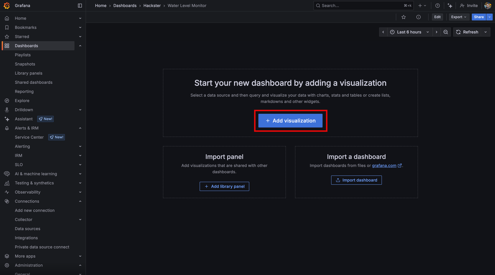

<!-- SPDX-FileCopyrightText: 2025 Common Ground Electronics <https://cgnd.dev> -->

<!-- SPDX-License-Identifier: Apache-2.0 -->

# Hackster Project - Story

> [!NOTE]
> This document contains the Markdown source text for the companion Hackster project page:
>
> <https://www.hackster.io/535995/cellular-water-level-sensor-firmware-for-thingy-91-x-b46700>

The [Nordic Thingy:91 X](https://www.nordicsemi.com/Products/Development-hardware/Nordic-Thingy-91-X) was designed to enable rapid development of prototypes for cellular IoT applications, such as asset trackers. In my recent article [First Steps with the Nordic Thingy:91 X](https://www.hackster.io/news/first-steps-with-the-nordic-thingy-91-x-84d082996304), I showed how to get started with the "out-of-the-box" asset-tracking firmware that Nordic ships with each new device.

However, the Thingy:91 X can be used for many other applications, including inclination sensing! By using the onboard low-power accelerometer to measure the inclination angle of a hinged float, it's possible to remotely measure changes in water levels.

Hackster Pro [Jeremy Cook](https://www.hackster.io/JeremyCook) set out to build a prototype of this idea. In his project, [Off-grid Cellular Water Level Monitor,](https://www.hackster.io/535535/off-grid-cellular-water-level-monitor-164868) he walks through the mechanical design and physical installation of the water level monitor prototype he built with the Thingy:91 X.


Jeremy asked me to help write some prototype firmware for the Thingy:91 X to enable remote water-level monitoring. In this companion Hackster project, I'll show how I adapted the [Zephyr](https://www.zephyrproject.org/)-based [Golioth Thingy:91 example firmware](https://github.com/golioth/thingy91-golioth) to send water level measurements over the cellular network to the [Golioth Cloud](https://golioth.io/). I'll also demonstrate how I used [InfluxDB](https://www.influxdata.com/products/influxdb-cloud/serverless/) and [Grafana](https://grafana.com/grafana/) to build a dashboard to visualize the water level measurement data in real-time from anywhere in the world.

## Accelerometer-based inclination sensing

For this project, Jeremy wanted to use the low-power accelerometer built into the Thingy:91 X to detect changes in water level, without requiring any external sensors.

The basic idea seemed pretty simple: strap the Thingy:91 X to a floating pivot arm, use the onboard accelerometer to measure the static inclination angle of the Thing:91 X, and use the measured angle to calculate the water level.


It turns out that this isn't a new idea. Analog Devices provides an application note [AN-1057: Using an Accelerometer for Inclination Sensing](https://www.analog.com/en/resources/app-notes/an-1057.html) which discusses the basic principles for converting the output of an accelerometer to an angle of inclination. There's even an [old Hackaday project](https://hackaday.io/project/186862-water-level-lora-sensor) by [Brian Wyld](https://hackaday.io/brian.wyld) which aimed to build a similar water level sensor by integrating a LoRaWAN radio with an STM32 and an accelerometer.

The Thingy:91 X has an onboard [ADXL367](https://www.analog.com/en/products/adxl367.html) Nanopower, 3-Axis, Digital Output MEMS Accelerometer. This accelerometer can be used to measure the angle of inclination relative to a reference position. In this case, the reference position is when the float is level to the hinge at the end of the float arm (i.e. the Thingy:91 X is "face up" parallel to the horizon). In this orientation, the accelerometer x- and y-axes are in the plane of the horizon (0 g field) and the z-axis is orthogonal to the horizon (1 g field).

This figure from the AN-1057 app note shows the three angles θ, ψ, and φ that can be measured for all points around the unit sphere:


Remember all that trigonometry you had to learn in Algebra 2? It's actually useful for something! ([SOH-CAH-TOA Style!](https://youtu.be/ZkheJDcld0E?feature=shared&t=40))

As the device tilts out of the plane of the horizon in the x or y-axes, the projection of the gravity vector on these axes produces an output acceleration. We can use the acceleration on these axes (measured by the accelerometer) to calculate the "pitch" and "roll" angles.

Here are the equations from AN-1057 for calculating the roll (`θ`) and pitch (`ψ`) angles:


Since the float hinge is designed to only pivot in one axis, the pitch angle `ψ` and the `FLOAT_LENGTH` constant value can be used to calculate the `float_height` value relative to the height of the hinge (our reference position where `float_height=0`).


When the pitch angle `ψ` is positive, the `float_height` is positive. Similarly, when the pitch angle `ψ` is negative, the `float_height` is negative.


There's one last thing we need to account for: on the Thingy:91 X, the accelerometer is located on the bottom side of the board.


As a result, the accelerometer axes are reversed relative to the horizon and the acceleration due to gravity is measured as a negative value. Therefore, the sign of the calculated inclination angles needs to be reversed.

### Caveats (this is a prototype!)

It's important to point out that there are some assumptions that we're making in this first prototype that affect the accuracy of the calculated float height.

First, we're assuming that the float is relatively static (water level changes very slowly) and the only static acceleration measured by the accelerometer is due to the force of gravity. Any additional movement on the device that results in non-gravitational acceleration will result in an apparent change in the inclination angle. Additional factors such as temperature, humidity, and mechanical stress on the PCB over time can also result in error offsets to the measured acceleration. Check out [this article](https://www.analog.com/en/resources/analog-dialogue/raqs/raq-issue-144.html) from Analog devices that discusses some of these considerations.

If this was a real product we were deploying in the field, it would be important to introduce calibration and stabilization/compensation to minimize these offset errors.

## Modifying the Golioth Thingy:91 Example App

The goal for this project was to measure water levels remotely. The heart of the Thingy:91 X is the Nordic [nRF9151](https://www.nordicsemi.com/Products/nRF9151) SiP with an integrated LTE-M/NB-IoT cellular modem. After calculating the water levels on the device, the built-in cellular modem can be used to stream the water level readings back to a database in the cloud.

For this prototype, we chose to use [Golioth](https://golioth.io/) as our IoT cloud platform. Golioth provides IoT cloud services for device management, such as over-the-air firmware updates, remote logging, and settings management. They also provide [Pipelines](https://golioth.io/pipelines) for routing streaming time-series IoT data to 3rd-party services. On the firmware side, Golioth provides an open-source firmware SDK which does all the heavy lifting for connecting a device to the Golioth cloud.

To make it easy to get started, Golioth provides an open-source [Thingy:91 Example](https://github.com/golioth/thingy91-golioth) firmware that supports the Thingy:91 X. Out of the box, it supports reading the ADXL367 low-power accelerometer and sending the accelerometer sensor values to the Golioth cloud.

To get Jeremy's prototype working quickly, I simply [forked the Thingy:91 Example firmware](https://github.com/golioth/thingy91-golioth/fork) from Golioth and made the following changes:

- Modified the Golioth Settings example code (`app_settings.c`) to allow the `ACCEL_NUM_SAMPLES`, `ACCEL_SAMPLE_DELAY_MS`, `MEASUREMENT_INTERVAL`, `FLOAT_LENGTH`, and `FLOAT_OFFSET` device settings to be configurable remotely via the Golioth cloud console.
- Modified the Golioth Stream Client example code (`app_sensors.c`) to convert the accelerometer sensor readings into inclination ("pitch" and "roll") angles. Then I used the pitch angle and `FLOAT_LENGTH` to calculate the water height value. A new water height reading is streamed to the Golioth cloud with a period set by the `MEASUREMENT_INTERVAL` device setting. The water level value can be adjusted on each device by a fixed `FLOAT_OFFSET` value before the measurement is sent to the cloud.
- Removed the example code demonstrating the Golioth LightDB State (`app_state.c`) and Remote Procedure Call (`app_rpc.c`) services, as well as the LED and buzzer examples, since these weren't needed for our project.
- Removed Thingy:91-specific code (we're only supporting the Thingy:91 X in this project).

All the firmware source code for this project is open-source on GitHub:

<https://github.com/cgnd/hackster-water-level-sensor>

If you want to try this out yourself, the [README.md](https://github.com/cgnd/hackster-water-level-sensor/blob/main/README.md) in the repo provides detailed instructions for setting up the NCS firmware development environment, building the firmware, and provisioning the device credentials.

## Golioth Cloud Configuration

Once the firmware has been built, a Golioth project needs to be created for managing the device via the cloud.

Follow the [Getting Started](https://docs.golioth.io/getting-started) guide in the Golioth docs to sign up for an account, register an organization, and create a new project for managing your devices.

For this project, I created a new organization named `hackster` and a project named "Water Level Sensor".


Golioth automatically creates a unique project ID based on the name: `water-level-sensor-b159cd`.

In order for the device to communicate with the Golioth IoT gateway service, it needs to be added to the project in the Golioth cloud console.

Under the "Devices" page, click on "Create". Give the device a Name and make sure the Credentials Type is set to "PSK (auto-generate)". It's also possible to set optional Tags, Blueprint, Cohort, and Hardware IDs while creating the device, but these are not required (see the [Golioth device management docs](https://docs.golioth.io/device-management/) for details on these options).

Click "Save" to create the new device.


This will automatically create the pre-shared key (PSK) credentials we need to set on the device so that it can securely connect to Golioth.


From the [README.md](https://github.com/cgnd/hackster-water-level-sensor/blob/main/README.md) in the firmware repo, we know that the [firmware depends on configurable device settings](https://github.com/cgnd/hackster-water-level-sensor/blob/main/README.md#settings-service) set via the Golioth Settings service. In the "Device Settings" page, default values for these settings need to be added for all devices in the project. These settings will be pushed to every device in the project.


It's also possible to override these settings for each device. The length of the float arm for Jeremy's device (`FLOAT_LENGTH`) needs to be set to 44 inches and the float offset (`FLOAT_OFFSET`) needs to be set to 26.4 inches. On the device-specific Settings tab, any changes to these values will be pushed to the specific device that's being configured, without affecting any other devices in the project.


## Connecting the device to Golioth

Brand new Thingy:91 X devices must be initially programmed with the firmware and provisioned with the PSK device credentials from Golioth.

Plug the USB cable into the Thingy:91 X, flip the power switch to the "ON" position, and connect a JTAG/SWD programmer to the debug port on the device. Follow the instructions in the [README.md](https://github.com/cgnd/hackster-water-level-sensor/blob/main/README.md) to flash the firmware and program the PSK device credentials.

Once the device reboots, it should automatically (and securely!) connect to Golioth and start sending water level readings to the Golioth Stream service.

## Configuring Golioth Pipelines

Now that the device is sending water level measurement data, Golioth needs to be configured to ingest and store the data. In Golioth, this is configured at the project level using [Pipelines](https://docs.golioth.io/data-routing/).

> Pipelines enable ingestion, transformation, and delivery of streaming data from devices to a wide array of destinations.

Pipelines are described as YAML documents typed into the editor interface in the Golioth console. The pipeline for this project is stored in the firmware repository as [cbor-to-lightdb-with-path.yml](https://github.com/cgnd/hackster-water-level-sensor/blob/main/pipelines/cbor-to-lightdb-with-path.yml).


This pipeline does the following steps:

- It transforms the [CBOR](https://cbor.io/) binary data serialization format sent by the device (via [CoAP](https://coap.space/)) into JSON using the [cbor-to-json](https://docs.golioth.io/data-routing/transformers/cbor-to-json) transformer.
- It nests the data message payload as a child object of the path of the data message using the [inject-path](https://docs.golioth.io/data-routing/transformers/inject-path) transformer.
- It routes the data to the [LightDB Stream](https://docs.golioth.io/application-services/lightdb-stream/) time-series database using the [lightdb-stream](https://docs.golioth.io/data-routing/destinations/lightdb-stream) destination.

The [README.md](https://github.com/cgnd/hackster-water-level-sensor/blob/main/README.md) in the firmware repository [describes how to set up the pipeline](https://github.com/cgnd/hackster-water-level-sensor/tree/main?tab=readme-ov-file#add-pipeline-to-golioth) in the Golioth cloud console. When the pipeline is enabled, the water level data will show up in the Golioth console under the device's "LightDB Stream" tab.


## Creating a dashboard with Grafana

Once the water level measurements are streamed to Golioth, they can be routed to other 3rd-party services via [Pipelines](https://docs.golioth.io/data-routing/).

The water level measurements are streamed as time-series data, so it's possible to create a dashboard to visualize the water level over specific time periods. [Grafana](https://grafana.com/oss/grafana/) is a popular open-source visualization platform that makes it easy to create dashboards without having to write any code. Grafana has options for self-managed instances hosted on your own infrastructure, or managed instances on their [Grafana Cloud](https://grafana.com/products/cloud/) service.

To keep things simple for this project, I opted for a dashboard hosted on the Grafana Cloud service. Initially, I tried to configure Grafana to read the time-series data directly from the [Golioth API](https://docs.golioth.io/reference/management-api/openapi). Unfortunately, the [Grafana Infinity Datasource](https://grafana.com/grafana/plugins/yesoreyeram-infinity-datasource/) plugin I was using doesn't support the method of pagination used by the Golioth API, so it can't automatically request additional pages of data if the query results exceed 100/page. As a result, Grafana was only able to display the latest 100 readings... Since we want to view water level changes over the course of days or even weeks, this was a deal breaker.

Instead, I set up another Golioth pipeline to route the time-series data from Golioth to an [InfluxDB Cloud Serverless](https://www.influxdata.com/products/influxdb-cloud/serverless/) database. They offer a free tier with 30 days of data retention, which is enough for the prototype testing that Jeremy was planning to do.

Grafana provides a robust [InfluxDB plugin](https://grafana.com/grafana/plugins/influxdb/) which is able to query the cloud database for the water level readings over any time scale. In the next sections, I'll show how to:

- Set up an InfluxDB bucket to store the sensor data
- Set up a Golioth Pipeline to send sensor data to InfluxDB
- Set up a Grafana dashboard to read the sensor data from the InfluxDB bucket

### InfluxDB Setup

Follow the instructions in the InfluxDB Cloud Serverless documentation to [sign up for a free account](https://docs.influxdata.com/influxdb3/cloud-serverless/sign-up/#start-for-free) and [create a bucket](https://docs.influxdata.com/influxdb3/cloud-serverless/admin/buckets/create-bucket/).

For this project, I created a bucket named `hackster_water_level_monitor`. On the free plan, the bucket has a data retention policy of 30 days.


Next, navigate to "API Tokens" and create an API token for the Golioth pipeline to use.


### Golioth InfluxDB Pipeline Setup

Now that we've got an InfluxDB bucket ready to store the sensor data, we can configure Golioth to send data to the bucket.

Similar to the LightDB Stream pipeline set up earlier, the Golioth InfluxDB pipeline configuration is a YAML document typed into the editor interface in the Golioth console. The YAML source is stored in the firmware repository as [cbor-to-influxdb.yml](https://github.com/cgnd/hackster-water-level-sensor/blob/main/pipelines/cbor-to-influxdb.yml).


This pipeline does the following steps:

- It transforms the [CBOR](https://cbor.io/) binary data serialization format sent by the device (via [CoAP](https://coap.space/)) into JSON using the [cbor-to-json](https://docs.golioth.io/data-routing/transformers/cbor-to-json) transformer.
- It routes the `sensor` data to the `hackster_water_level_sensor` InfluxDB bucket using the [influxdb](https://docs.golioth.io/data-routing/destinations/influxdb) destination. Note that the `$INFLUXDB_TOKEN` variable allows the InfluxDB token to be stored securely using Golioth [Pipeline Secrets](https://docs.golioth.io/data-routing/secrets/).

Once this pipeline is enabled, Golioth will forward the time series sensor data to InfluxDB.

### Grafana Dashboard Setup

The Grafana free plan is limited to one "Cloud Stack" (instance), but each cloud stack can host multiple dashboards. Follow the [Getting Started](https://grafana.com/docs/grafana-cloud/get-started/) instructions in the Grafana docs to sign up for a Grafana account and create the cloud stack instance.

To get started configuring the dashboard, the cloud stack instance must be launched from the Grafana Cloud Portal.


With the cloud stack launched, the first step is to configure a "Data Source". Data sources are plugins that provide the sources of data for Grafana to visualize.

The [Grafana InfluxDB plugin](https://grafana.com/grafana/plugins/influxdb/) is a popular plugin that supplies Grafana dashboards with data from InfluxDB endpoints.

Under "Data Sources", create a new InfluxDB data source instance named `InfluxDB - Hackster Water Level Monitor`.

1. Set the "URL" field to your InfluxDB URL (e.g. <https://us-east-1-1.aws.cloud2.influxdata.com>).
2. Set the "Product" field to "InfluxDB Cloud Serverless".
3. Set the "Query language" field to "Flux".
4. Under "Database settings", configure your InfluxDB Organization ID, bucket name, and token.
5. Click the "Save & test" button.
6. You should see a message saying "datasource is working".


Next, on the Dashboards page, click "New" to create a new Dashboard.


Click "Save dashboard".


Give the dashboard a title (e.g. "Water Level Monitor").


Click the "+ Add visualization" button to add a chart.



Select the InfluxDB data source set up earlier when prompted (e.g. `InfluxDB - Hackster Water Level Monitor`).


Add the following query to the visualization (make sure to replace `<your-golioth-device-id>` with your Golioth Device ID and `<your-golioth-project-id>` with your Golioth Project ID).

```plaintext
from(bucket: "hackster_water_level_monitor")
  |> range(start: v.timeRangeStart, stop:v.timeRangeStop)
  |> filter(fn: (r) =>
    r.device_id == "<your-golioth-device-id>" and
    r.project_id == "<your-golioth-project-id>" and
    r._measurement == "sensor" and
    r._field == "water_level.float_height"
  )
```


In the panel options, make sure the visualization type is set to "Time Series" and give the panel a title (e.g. "Water Level").


Set the unit for the y-axis and optionally set min, max, and display name values.


Now, check to make sure everything is working correctly. Set the time range and the water level data should be displayed in the chart. If everything looks OK, click "Save dashboard" and "← Back to dashboard" buttons.


The dashboard should now have a single visualization showing the water level as it changes over time! 🎉


## Over-the-Air Firmware Updates

What happens when we need to update the device firmware in the field? It's not very much fun having to disassemble the device and flash it with a JTAG programmer every time the firmware changes...

Golioth provides a robust Over-the-Air firmware update service which can be used to update the device firmware via the cellular network. This includes the ability to group devices into cohorts for progressively updating a fleet of devices over time.

The README.md in the firmware repository [describes how to configure firmware updates](https://github.com/cgnd/hackster-water-level-sensor/tree/main?tab=readme-ov-file#ota-firmware-update) in the Golioth cloud console.

The first step is to create a firmware "Package" by uploading the OTA firmware binaries (ending in `zephyr.signed.bin`) downloaded from the [Releases](https://github.com/cgnd/hackster-water-level-sensor/releases) page.

For this project, I created a package named `thingy91x` since this firmware package is destined for Thingy:91 X devices. The image below shows multiple firmware versions that have been uploaded for this package.


Next, "Cohorts" are created and the devices to be updated are added to the cohorts. For this project, I created two cohorts: one named `Chris` for my devices and another named `Jeremy` for Jeremy's devices. This allows me to upgrade my own devices first before pushing a (potentially broken) new update to Jeremy's devices.


Each cohort maintains its own sequence of "Deployments", where each deployment updates all the devices in the cohort with a specific firmware version (or rolls back the firmware to a previous version).

In the image below, the `Chris` cohort has a single deployment with the name `chris-202507161602` that deploys `v1.0.0` of the `thingy91x` package to all my Thingy:91 X devices.


## Next Steps

While we've got the basic concept of the water level sensor working, this initial prototype is pretty far from ready for a real deployment. There's a couple things we'd like to improve in the next phase.

First, we need to do some additional testing to determine how accurate the measured water levels are in real life scenarios. This may involve adding some calibration steps to initially calibrate the measurements when the device is installed. We may also need to add some more advanced filtering to the measurements to compensate for external sources of noise (such as waves in the water or vibrations due to wind).

Finally, we'd like to extend the functionality to send a notification (such as a text message or an email) when the water level has crossed a pre-defined threshold value.
